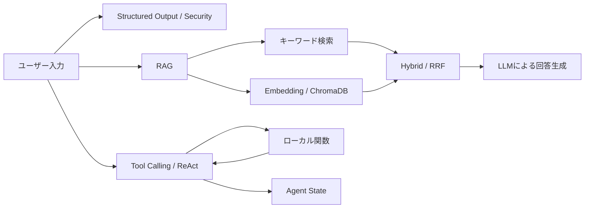

# LLM 100 Days Practice

100日間で、LLM APIを呼ぶだけのサンプルから、評価・安全性・運用まで考えられるLLM/AIエンジニアを目指す学習プロジェクトです。

現在はDay 31です。Day 1〜30相当では、構造化出力、RAG、Embedding、ChromaDB、ハイブリッド検索、Tool Calling、ReAct、状態管理を実装しました。今後の計画は[Day 31〜100カリキュラム](./CURRICULUM_DAY31_100.md)を参照してください。

## 現在の構成



現時点では、各テーマを独立したPythonスクリプトとして学ぶ構成です。統一されたアプリケーション構成、テスト、評価、API化はDay 32以降で追加します。

## 必要なもの

- Python 3.11以上
- [uv](https://docs.astral.sh/uv/)
- OpenAI API key

OpenAI APIを呼ぶスクリプトは利用料金が発生する可能性があります。実行前にAPIの利用上限と課金設定を確認してください。

## セットアップ

リポジトリのルートで次を実行します。

```bash
uv sync
cp .env.example .env
```

作成した `.env` の値を、自分のAPI keyに置き換えます。

```dotenv
OPENAI_API_KEY=your_actual_api_key
```

`.env` はGitの管理対象外です。API keyをコード、README、コミット履歴へ含めないでください。

まず、APIを使わないスクリプトでPython環境を確認します。

```bash
uv run python main.py
uv run python rrf_search.py
uv run python agent_state_model.py
```

その後、最小のAPIサンプルを実行します。

```bash
uv run python structured_output.py
```

構造化された記事分析結果が表示されれば、セットアップは完了です。

## 推奨学習順

### 1. APIと構造化出力

| ファイル | 内容 | API使用 |
|---|---|:---:|
| `main.py` | Python実行確認 | なし |
| `structured_output.py` | Pydanticによる記事分析の構造化出力 | あり |
| `security_filter.py` | 入力を攻撃・安全に分類する試作 | あり |

```bash
uv run python structured_output.py
uv run python security_filter.py
```

### 2. RAGとEmbedding

| ファイル | 内容 | 事前条件 |
|---|---|---|
| `simple_rag.py` | キーワード一致による最小RAG | なし |
| `vector_rag.py` | Embeddingとコサイン類似度による検索 | なし |
| `chroma_rag.py` | ChromaDBへサンプル文書を登録・検索 | なし |
| `chroma_rag_complete.py` | ChromaDBの検索結果から回答を生成 | `chroma_rag.py`を先に実行 |

```bash
uv run python simple_rag.py
uv run python vector_rag.py
uv run python chroma_rag.py
uv run python chroma_rag_complete.py
```

ChromaDBのデータは `.chroma_data/` に保存され、Gitには追加されません。

### 3. チャンキングとファイル取り込み

| ファイル | 内容 | 入力 |
|---|---|---|
| `chanking_rag.py` | 長文の分割、オーバーラップ、ChromaDB登録 | ファイル内のサンプル文書 |
| `file_ingest_rag.py` | `docs/*.txt` の一括取り込み | `docs/expenses.txt`, `docs/security.txt` |

```bash
uv run python chanking_rag.py
uv run python file_ingest_rag.py
```

ファイル名の `chanking` は既存の学習履歴を保つため、そのままにしています。

### 4. ハイブリッド検索とRRF

| ファイル | 内容 | 事前条件 |
|---|---|---|
| `hybrid_test.py` | 比較用コレクションの作成とベクトル検索 | なし |
| `hybrid_search.py` | 完全文字列一致のボーナスによる再ランキング | `hybrid_test.py`を先に実行 |
| `rrf_search.py` | 模擬ランキングを使ったRRF計算 | API不要 |

```bash
uv run python hybrid_test.py
uv run python hybrid_search.py
uv run python rrf_search.py
```

現状の `hybrid_search.py` はBM25そのものではなく、キーワード一致ボーナスの実験です。実際のBM25と評価セットはDay 45以降で実装します。

### 5. Tool Callingとエージェント

| ファイル | 内容 | API使用 |
|---|---|:---:|
| `tool_calling_basic.py` | LLMが呼び出したい関数と引数を取得 | あり |
| `tool_calling_complete.py` | 関数実行結果をLLMへ返して最終回答を生成 | あり |
| `agent_function.py` | 暗号化関数を使うエージェント | あり |
| `agent_react_loop.py` | 天気とコース情報を順番に調べるReActループ | あり |
| `agent_state_model.py` | 状態とログを保持する最小モデル | なし |

```bash
uv run python tool_calling_basic.py
uv run python tool_calling_complete.py
uv run python agent_function.py
uv run python agent_react_loop.py
uv run python agent_state_model.py
```

## ディレクトリと主要ファイル

```text
.
├── docs/                       # RAGへ取り込むサンプル文書
├── .chroma_data/               # 実行時に生成されるローカルDB（Git対象外）
├── structured_output.py        # 構造化出力
├── security_filter.py          # LLMベースの安全性判定
├── simple_rag.py               # キーワードRAG
├── vector_rag.py               # ベクトル検索
├── chroma_rag*.py              # ChromaDBを使ったRAG
├── chanking_rag.py             # チャンキング
├── file_ingest_rag.py          # ファイル取り込み
├── hybrid_*.py                 # 検索方式の比較
├── rrf_search.py               # RRF
├── tool_calling_*.py           # Tool Calling
├── agent_*.py                  # ReActと状態管理
├── memo.md                     # 日々の学習メモ
└── CURRICULUM_DAY31_100.md     # Day 100までの計画
```

## 既知の制約と今後の改善

- 各スクリプトにモデル名、prompt、閾値が直接書かれている
- 実行時にAPI障害、timeout、rate limitを十分処理していない
- 自動テスト、型検査、Lint、固定評価セットがまだない
- ChromaDBの一部スクリプトは、別スクリプトが作ったcollectionを前提とする
- `security_filter.py` はLLM分類の試作であり、単独で完全な防御にはならない
- `hybrid_search.py` は本格的なBM25実装ではない
- RAG回答には検証可能なsource/page引用がまだない
- ReActループには永続化、再開、Human-in-the-Loopがまだない
- 使用しているモデルやAPI形式は学習時点の例であり、利用前に公式ドキュメントで現行仕様を確認する必要がある

これらは不具合を隠すための一覧ではなく、Day 32〜100で順番に解消する学習課題です。

## 学習記録

- 日々のメモ: [memo.md](./memo.md)
- Day 31〜100: [CURRICULUM_DAY31_100.md](./CURRICULUM_DAY31_100.md)

毎日の終了時に、最低限次を記録します。

```text
仮説:
実装・実験:
結果:
失敗・気づき:
次の一手:
```
